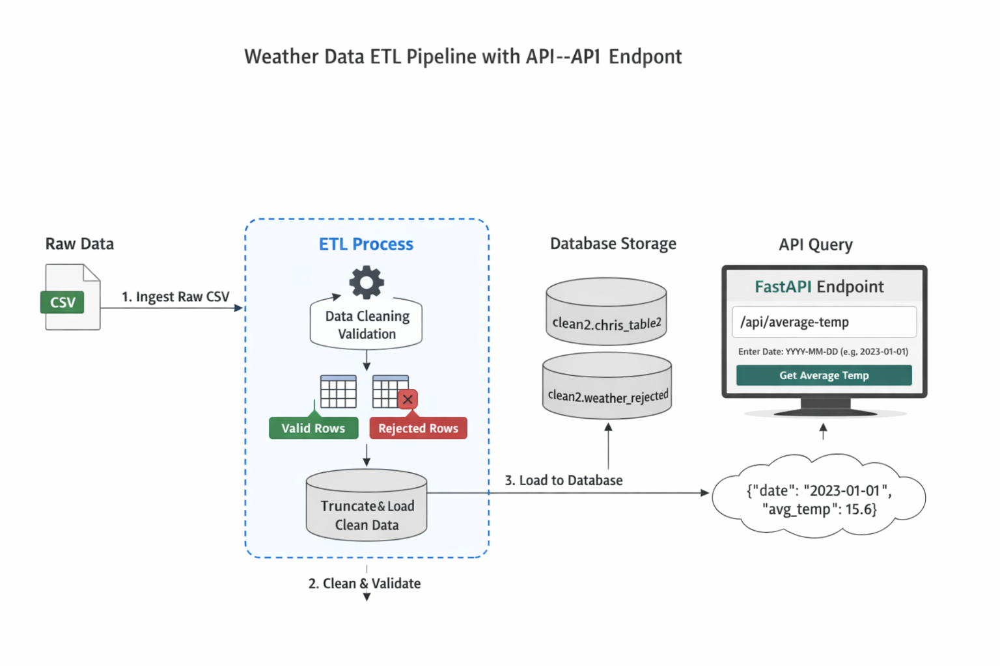

# Weather Data Engineering Pipeline with FastAPI 

## Project Overview
This project implements a full **ETL (Extract, Transform, Load) pipeline** for weather data.

- Extract raw CSV data from SMHI API(Sweden)
- Load raw data into database(PostgreSQL)
- Transform and clean the data
- Load into PostgreSQL (Dockerized)
- Serve results via FastAPI API(Endpoints ,both in Swgger UI and client, pgAdmin)

---

## Architecture

SMHI API → CSV File → Raw Table → Cleaning & Validation → Clean Table → API Endpoint



---

## Tech Stack

- Python 3.12
- PostgreSQL (Docker)
- FastAPI
- Pandas
- Psycopg
- Docker Compose

---

## Project Structure
```

project/
│
├── app/                         
│   ├── main.py                  

│
├── etl/                         
│   ├── pipeline.py             
│   ├── ingestion.py             
│   ├── transformation.py         
│   ├── loading.py               
│
├── data/                        
│   ├── weather_data.csv
│   └── output/
│       ├── accepted_weather.csv
│       └── rejected_weather.csv
│
├── sql/                         
│   ├── init.sql   
    ├── ingestion.sql              
│   ├── queries.sql              
│
├── notebooks/                    
│   ├── eda.ipynb
│   └── testing_pipeline.ipynb
│
├── test_scripts/                
│   ├── test_cleaning.py
│   ├── test_validation.py
│   ├── test_db.py
    └── unit_test_pipeline.py
│
├── docs/                       
│   ├── architecture.png         
│   ├── api_docs.md
│   └── affärskrav.md 
    └── glossary.md
    └── others.md    
│
├── docker/                     
│   ├── Dockerfile
│   
│
├── docker-compose.yml
├── requirements.txt
├── .env
├── .gitignore
└── README.md
└── unit_test_pipeline.py
└──weather_data_etl_API_endpoint.png
``` 

---

##  ETL Pipeline Steps

### 1. Extract
- Read CSV file
- Store raw data in `raw2.chris_table` schema

### 2. Transform
- Convert data types
- Remove duplicates
- Flag invalid rows

### 3. Validation

- Separates:
- Valid rows
- Rejected rows
- Adds reject_reason column

### 4. Load
- Truncates clean table (prevents duplicates)
- Store clean data in `clean2.chris_table2` schema
- Save rejected data for auditing

### 5. Output Files
- accepted_weather.csv

- rejected_weather.csv


### Data Quality Rules(SMHI Data cannot be manipulated)
- A row is rejected if:
- Invalid date
- Invalid temperature
- Temperature ≥ 100 or -100
- Created at > Updated  

### Data Quality Features
- Duplicate removal
- Validation flags
- Rejected data tracking
- Clean schema separation

---

##  How to Run

### 1. Clone the repo
```bash
git clone <your-repo>
cd project

2. Create .env

    POSTGRES_DB=history_weather
    POSTGRES_USER=postgres
    POSTGRES_PASSWORD=yourpassword
    POSTGRES_HOST=postgres
    POSTGRES_PORT=5432 

3. Run Docker
    docker-compose down -v
    docker-compose up --build

API Endpoint

Get Average Temperature

Endpoint:

    GET /api/average-temp?date=YYYY-MM-DD

Example:

    http://localhost:8000/api/average-temp?date=2000-01-02

Response:

    {
    "date": "2000-01-02",
    "avg_temp": 1.6
    }
```

### Docker Services/Behaviour
- ETL runs automatically on startup
- Waits for PostgreSQL
- Loads data
- Starts FastAPI server


---
### Common Issues
1. Database does not exist
Fix:

    ```
    docker-compose down -v
    docker-compose up
    ```

2. Host resolution error
    - Use postgres inside Docker
    - Use localhost locally

3. Duplicate data
Solved by:
    ```
    TRUNCATE clean2.chris_table2
    ```

---

### Summary
- This project demonstrates:
- End-to-end ETL pipeline
- Data validation & quality tracking
- Dockerized database setup
- API-based data access(Endpoint)

---


### Contributors
-Anja, Christopher, Dennis , Karl and Mossad – Data Engineering Project