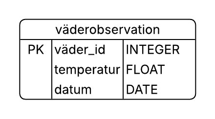

# Description

The following model illustrates the structure of the "väderobservation" (weather observation) table used in this project.

| Column | Data Type | Description |
| :--- | :--- | :--- |
| `väder_id` | **INTEGER** | **Primary Key (PK)**. A unique identifier for each observation |
| `temperatur` | **FLOAT** | The recorded temperature |
| `datum` | **DATE** | The date the observation was recorded |

