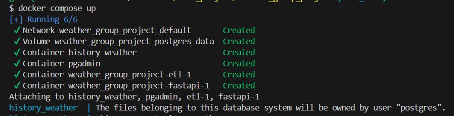
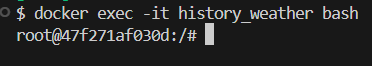
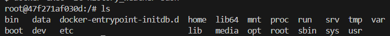
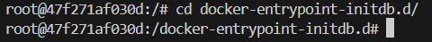
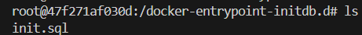
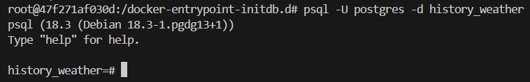
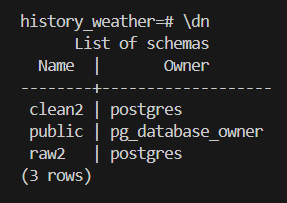
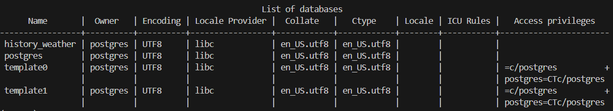
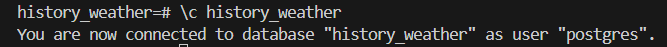
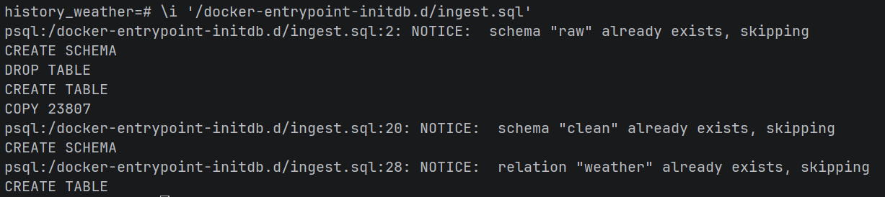

# Docker Setup and PostgreSQL Data Ingestion Walkthrough

*Note: the naming convention may have changed, for example from "raw2" ---> "raw" and from "clean2" ---> "clean".

This guide explains how to:
- start the Docker container, 
- connect to the PostgreSQL database,
- run the initialization script, 
- verify that the data has been ingested.

## The steps

1. **Start Docker deskstop**

2. **Create and run the container** (including the PostgreSQL database) with:  
docker compose up

 
 
3. **Open an interactive terminal** (with -it) inside the container "history_weather":  
docker exec -it history_weather bash

 
 
4. **List all the files/directories** inside the container: 
ls

 
 
5. **Go into the relevant folder**, here docker-entrypoint-initdb.d/ by doing:  
cd docker-entrypoint-initdb.d/

 
 
6. *Check that the ingest.sql file* (initialization) is there:  
ls

 
 
7. **Connect to the PostgreSQL database using the psql CLI** ("-U postgres" connects as postgres user and "-d history_weather" connects to the dbs "history_weather"): 
psql -U postgres -d history_weather

 
  
=> You can see 
- the schemas by doing: \dn
- the dbs by doing: \l

 

 
 
8. **Connect to the database** "history_weather": 
\c history_weather

 
 
9. **Run the SQL ingest script to create the schemas, tables and load** the data: 
\i '/docker-entrypoint-initdb.d/ingest.sql'

 
 
10. **Query the table** to check that the data was successfully ingested: 
SELECT * FROM raw2.chris_table LIMIT 20;